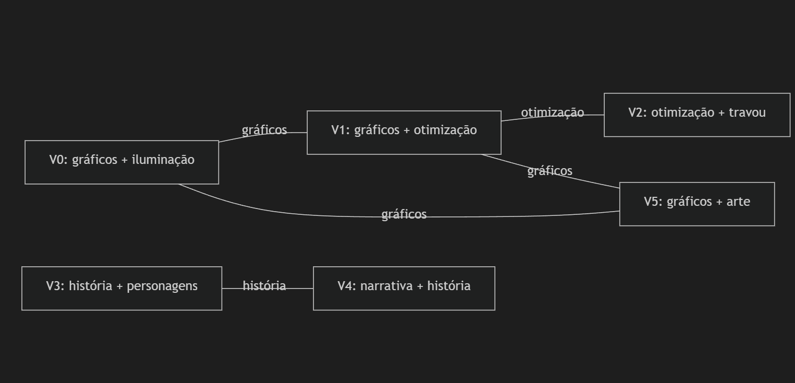
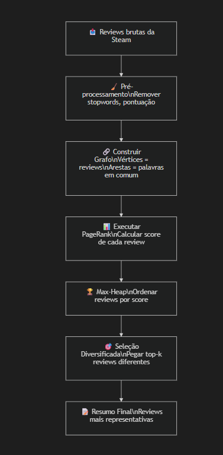

# Como o PageRank Funciona no Nosso Projeto

## 1. O que são os Vértices?

Cada **review** (avaliação) é um vértice do grafo. Simples assim.

Se temos 6 reviews de um jogo na Steam, temos 6 vértices:

```
V0 = "O jogo tem gráficos incríveis e a iluminação é muito realista"
V1 = "Os gráficos são bonitos mas a otimização é péssima"
V2 = "Travou várias vezes, otimização horrível no PC"
V3 = "A história é envolvente e os personagens são bem escritos"
V4 = "Narrativa excelente, melhor história que já joguei"
V5 = "Gráficos lindos, a direção de arte é espetacular"
```

Cada vértice guarda:
- O **texto original** da review
- As **palavras-chave** (depois de limpar stopwords como "o", "a", "é", "de")

Por exemplo, V0 depois de processado fica:

```
V0 original:  "O jogo tem gráficos incríveis e a iluminação é muito realista"
V0 processado: ["jogo", "gráficos", "incríveis", "iluminação", "realista"]
```

---

## 2. Como as Arestas são Criadas?

Conectamos dois vértices quando as reviews têm **palavras em comum**. O peso da aresta é baseado em quantas palavras elas compartilham.

### Exemplo passo a passo

Vamos processar (limpar) cada review:

| Vértice | Palavras-chave |
|---------|---------------|
| V0 | jogo, gráficos, incríveis, iluminação, realista |
| V1 | gráficos, bonitos, otimização, péssima |
| V2 | travou, vezes, otimização, horrível, pc |
| V3 | história, envolvente, personagens, escritos |
| V4 | narrativa, excelente, história, joguei |
| V5 | gráficos, lindos, direção, arte, espetacular |

Agora comparamos **todos os pares**:

| Par | Palavras em Comum | Quantas? | Cria Aresta? |
|-----|-------------------|----------|-------------|
| V0 ↔ V1 | **gráficos** | 1 | ✅ Sim |
| V0 ↔ V2 | *(nenhuma)* | 0 | ❌ Não |
| V0 ↔ V3 | *(nenhuma)* | 0 | ❌ Não |
| V0 ↔ V4 | *(nenhuma)* | 0 | ❌ Não |
| V0 ↔ V5 | **gráficos** | 1 | ✅ Sim |
| V1 ↔ V2 | **otimização** | 1 | ✅ Sim |
| V1 ↔ V3 | *(nenhuma)* | 0 | ❌ Não |
| V1 ↔ V4 | *(nenhuma)* | 0 | ❌ Não |
| V1 ↔ V5 | **gráficos** | 1 | ✅ Sim |
| V2 ↔ V3 | *(nenhuma)* | 0 | ❌ Não |
| V2 ↔ V4 | *(nenhuma)* | 0 | ❌ Não |
| V2 ↔ V5 | *(nenhuma)* | 0 | ❌ Não |
| V3 ↔ V4 | **história** | 1 | ✅ Sim |
| V3 ↔ V5 | *(nenhuma)* | 0 | ❌ Não |
| V4 ↔ V5 | *(nenhuma)* | 0 | ❌ Não |

---

## 3. O Grafo Resultante

Visualmente, o grafo fica assim:



Perceba que se formam **dois grupos**:
- **Grupo "Gráficos/Otimização"**: V0, V1, V2, V5
- **Grupo "História/Narrativa"**: V3, V4

> [!NOTE]
> V1 é o vértice mais conectado do grupo da esquerda — ele fala de **gráficos** (conectando a V0 e V5) **e** de **otimização** (conectando a V2). Isso faz dele uma review "ponte" que cobre dois assuntos. O PageRank vai dar um score alto a ele.

---

## 4. Como o PageRank Calcula os Scores

### Ideia Central

A lógica do PageRank é:

> **Uma review é importante se está conectada a outras reviews que também são importantes.**

É como uma votação:
- Cada review "vota" nas reviews conectadas a ela
- O voto de uma review importante vale mais
- Quem recebe mais votos importantes = maior score

### Passo a Passo do Algoritmo

#### Passo 0 — Inicialização

Todos os vértices começam com score igual: `1/N` (onde N = número de vértices)

```
N = 6

V0: score = 1/6 = 0.167
V1: score = 1/6 = 0.167
V2: score = 1/6 = 0.167
V3: score = 1/6 = 0.167
V4: score = 1/6 = 0.167
V5: score = 1/6 = 0.167
```

#### Passo 1 — Primeira Iteração

Para cada vértice, calculamos o novo score usando a fórmula:

```
PR(vi) = (1-d)/N + d × Σ( PR(vj) / grau(vj) )
```

Onde:
- **d = 0.85** (fator de amortecimento — padrão do PageRank)
- **N = 6** (total de vértices)
- **grau(vj)** = quantas arestas o vizinho vj tem

Vamos calcular o novo score de **V1** (que tem 3 vizinhos: V0, V2, V5):

```
Vizinhos de V1: V0 (grau 2), V2 (grau 1), V5 (grau 2)

Contribuição de V0 = PR(V0) / grau(V0) = 0.167 / 2 = 0.083
Contribuição de V2 = PR(V2) / grau(V2) = 0.167 / 1 = 0.167
Contribuição de V5 = PR(V5) / grau(V5) = 0.167 / 2 = 0.083

Soma das contribuições = 0.083 + 0.167 + 0.083 = 0.333

PR(V1) = (1-0.85)/6 + 0.85 × 0.333
PR(V1) = 0.025 + 0.283
PR(V1) = 0.308
```

Agora **V2** (que tem apenas 1 vizinho: V1):

```
Vizinhos de V2: V1 (grau 3)

Contribuição de V1 = PR(V1) / grau(V1) = 0.167 / 3 = 0.056

PR(V2) = (1-0.85)/6 + 0.85 × 0.056
PR(V2) = 0.025 + 0.047
PR(V2) = 0.072
```

> [!TIP]
> Perceba: V1 recebeu score **0.308** (alto, porque tem 3 vizinhos votando nele) enquanto V2 recebeu **0.072** (baixo, porque só tem 1 vizinho e esse vizinho divide seus votos entre 3). O PageRank naturalmente destaca os vértices mais centrais do grafo.

#### Passos 2, 3, 4... — Iterações seguintes

O algoritmo repete o mesmo cálculo usando os **novos scores** da iteração anterior. Os scores vão mudando a cada iteração até **convergir** (ou seja, até os valores pararem de mudar significativamente).

Tipicamente converge em 20-50 iterações.

#### Resultado Final (após convergência)

Depois de várias iterações, os scores estabilizam. Num cenário como o nosso exemplo, o resultado seria algo como:

```
V0: score = 0.18   ← gráficos (2 conexões)
V1: score = 0.28   ← gráficos + otimização (3 conexões) ⭐ MAIOR
V2: score = 0.08   ← otimização (1 conexão)
V3: score = 0.12   ← história (1 conexão)
V4: score = 0.12   ← narrativa + história (1 conexão)
V5: score = 0.18   ← gráficos (2 conexões)
```

> [!IMPORTANT]
> **V1 tem o maior score** porque é a review mais "central" — ela conecta o sub-tópico de gráficos com o de otimização. Ela é a review mais representativa do grupo.

---

## 5. Seleção das Reviews para o Resumo

Agora que cada review tem um score, o professor perguntou: **quantas reviews pegar?**

### A Heurística (pedido do professor)

O professor disse que é preciso definir uma regra para decidir quantas pegar. As opções:

| Estratégia | Exemplo (50 reviews) |
|-----------|----------------------|
| **10% do total** | 5 reviews |
| **20% do total** | 10 reviews |
| **30% do total** | 15 reviews |
| **k fixo** | Sempre 5 reviews |

### O Problema da Diversidade

O professor enfatizou: não basta pegar as reviews de maior score. Se as 3 melhores reviews falam todas sobre "gráficos", o resumo fica repetitivo.

A solução é o **Greedy Diversificado**:

```
1. Ordenar reviews por score (maior → menor)
2. Pegar a 1ª (maior score)
3. Para cada próxima candidata:
   - Se é DIFERENTE das já selecionadas → aceitar
   - Se é PARECIDA com alguma já selecionada → pular
4. Repetir até ter k reviews
```

No nosso exemplo, querendo 3 reviews:

```
Candidatas em ordem: V1(0.28), V0(0.18), V5(0.18), V3(0.12), V4(0.12), V2(0.08)

1ª seleção: V1 "gráficos + otimização" ✅ (aceita, é a primeira)
2ª candidata: V0 "gráficos + iluminação"
   → V0 é parecida com V1? Sim! (compartilham "gráficos") → ❌ PULAR
3ª candidata: V5 "gráficos + arte"
   → V5 é parecida com V1? Sim! (compartilham "gráficos") → ❌ PULAR
4ª candidata: V3 "história + personagens"
   → V3 é parecida com V1? Não! (nenhuma palavra em comum) → ✅ ACEITA
5ª candidata: V4 "narrativa + história"
   → V4 é parecida com V3? Sim! (compartilham "história") → ❌ PULAR
6ª candidata: V2 "otimização + travou"
   → V2 é parecida com V1? Sim! (compartilham "otimização") → ❌ PULAR

Resultado final (k=2 aceitas):
  V1: "Os gráficos são bonitos mas a otimização é péssima"
  V3: "A história é envolvente e os personagens são bem escritos"
```

> [!TIP]
> O resumo final cobre **dois tópicos diferentes** (gráficos/performance e história) sem repetição — exatamente o que o professor pediu!

---

## 6. Resumo Visual do Pipeline Completo



---

## 7. A Fórmula do PageRank (para referência)

```
PR(vi) = (1-d)/N + d × Σ(j∈vizinhos(i)) [ PR(vj) × w(j,i) / Σ(k∈vizinhos(j)) w(j,k) ]
```

| Símbolo | Significado | Valor Típico |
|---------|------------|-------------|
| **PR(vi)** | Score de importância do vértice i | Calculado |
| **d** | Fator de amortecimento | 0.85 |
| **N** | Número total de vértices | Depende dos dados |
| **w(j,i)** | Peso da aresta entre j e i | Similaridade |
| **Σw(j,k)** | Soma dos pesos de todas as arestas de j | Grau ponderado |

O **(1-d)/N** é a probabilidade de "pular aleatoriamente" para qualquer vértice. Isso garante que mesmo vértices isolados recebam um score mínimo e o algoritmo sempre convirja.
